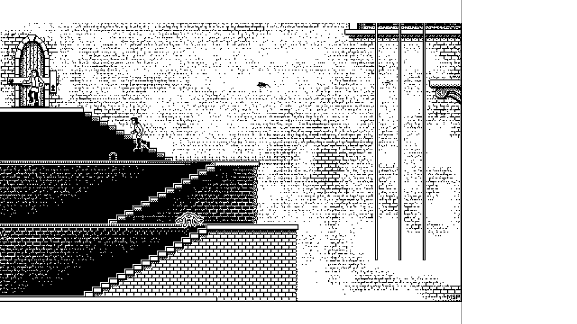

# Dark Castle

A port of the 1986 Macintosh game to the LilyGo / M5Paper e-paper boards,
running on EPD_Painter.

**This is not an emulator.** No 68000 code is executed in any form. The
original artwork is extracted from a disk image *you* supply, and the game
around it is written fresh in C++ against this library.



---

## Before you can build it

No game data ships in this repository. Point the extractor at your own copy:

```
python3 tools/dc_extract.py /path/to/DarkCastle_1_2.dsk
```

That writes `dc_gfx_screens.cpp` and `dc_gfx_sprites.cpp` beside the sketch —
about 330 KB of assets, still in the game's own compressed form, decoded on the
fly by `dc_codec.h`. Then open `DarkCastle.ino` in the Arduino IDE as usual.

Requires **Adafruit GFX** and **[GT911 Lite](https://github.com/tonywestonuk/gt911-arduino)**.
The build lands at roughly 56% of a default 1.3 MB app partition.

The extractor needs no third-party modules. Modern macOS can no longer mount
HFS standard volumes, so it parses the disk image itself.

---

## The two things that had to change

### Shape: 4:3 to 16:9

The Mac was 512x342 and the playfield 512x310 — the original blitter clips at
row 310 and the rest was the status strip. This panel is 960x540. Pillarboxing
would waste a third of it, so:

```
 0                                        768        960
 +------------------------------------------+----------+
 |                                          |  SCORE   |
 |        playfield, 768 x 465              |  LIVES   |
 |        (512 x 310 scaled by 3/2)         |  LIFE    |
 |                                          |          |
 |                                          |  [JUMP]  |
 |                                          |  [<][>]  |
 |                                          | [DUCK]   |
 +------------------------------------------+----------+
```

3/2 was chosen because it is exact in both axes and *periodic*: two source
pixels always become three, so a sprite looks the same at every position and
does not shimmer as it crosses the screen. An arbitrary scale factor would
crawl.

The scaler resolves to **four grey levels, not two**. The Mac drew its greys as
50% dither patterns; upscaling those one-to-one produces moire. Area averaging
each output pixel over the 1, 2 or 4 source pixels it covers turns those
patterns into the panel's real mid-greys, so brickwork reads as texture rather
than interference. Coverage maps `0, ¼, ½, ¾, 1` to levels `0, 1, 2, 2, 3` —
half coverage deliberately lands on 2, because a 50% Mac dither reads dark.

### Input: a mouse that is not there

Dark Castle aimed thrown rocks at the mouse pointer and moved on the keyboard.
There is no pointer here, so the gesture becomes *more* direct rather than less:

- **Tap the playfield where you want the rock to go.** That is the whole aiming
  model — the throw is launched at the point you touched.
- **In the Great Hall, tap a door.** The hall is drawn in one-point perspective,
  so its doors are up on the back wall and cannot be walked into. Tap one and
  the hero runs to it, it opens, he steps through, and it shuts behind him. The
  centre door uses the game's own opening animation — `PPCT 10050` is 64×159
  and the centre door in the artwork is exactly 64 wide by 159 tall, which is
  not a coincidence.
- Movement, jump, duck and run move to the touch column.
- Serial keys work as well: `a`/`d` move, `w` jumps, `s` ducks, `S` toggles
  run, `r` back to the title, `n`/`p` jump rooms, `1`/`2`/`3` set panel quality,
  `t` toggles the tuned direct trains.

GT911 reports a single point, so you cannot hold a direction *and* throw in the
same instant. In practice you stop, throw, and move on, which suits the pace of
an e-paper refresh.

---

## How it is put together

| File | What it does |
|---|---|
| `DarkCastle.ino` | setup, input, the frame loop, the status column |
| `dc_codec.h` | both original codecs, ported from the game's 68k |
| `dc_assets.h`, `dc_gfx_*.cpp` | the artwork, still compressed (generated) |
| `dc_video.h/.cpp` | composition at 512x310, then the 3/2 scaler |
| `dc_rooms.h/.cpp` | the world: screens, derived collision, exits, spawns |
| `dc_game.h/.cpp` | hero physics, rocks, enemies, scoring |
| `dc_ui.h` | touch column geometry |
| `tools/dc_extract.py` | disk image to C++ |
| `tools/dc_probe.py` | prints a room's derived collision, for authoring |
| `FORMATS.md` | the reverse engineering, with citations |

Composition happens in the original's own 1-bit 512x310 buffer, exactly as the
Mac did it — background copied in, sprites masked over the top. Only dirty
rectangles are rescaled into the panel canvas, and EPD_Painter then delta
updates only what actually changed, so a frame costs roughly what the sprites
cover rather than what the screen holds.

### Collision comes from the pictures

Dark Castle shipped no geometry data; the floors exist only in the artwork. So
the solid map is *derived* from each room's bitmap at load: a 4-pixel grid where
a cell is solid if 13 of its 16 pixels are ink. That threshold is what separates
a floor from a wall — the walls are 50% dither and fall well below it.

It is not sufficient on its own. The cave rooms use large genuinely solid black
masses as scenery, and the Great Hall's floor is a thin line far below the
threshold. Each room therefore carries a short fixup list forcing rectangles
solid or clear. To see what a room derives to:

```
python3 tools/dc_probe.py DarkCastle_1_2.dsk 1000 --map
```

Walking up stairs falls out of this for free: when horizontal movement is
blocked the hero tries lifting his feet up to 12px, so a flight of steps is
simply walkable.

---

## What is done, and what is not

Being straight about this, because "port of Dark Castle" could mean a lot of
things.

**Complete and faithful:**

- Both bitmap codecs, reversed from the original machine code. Every one of the
  20 screens decodes to exactly the expected 21888 bytes and all 172 sprite
  sets decode with the stream fully consumed — the formats are certainly right,
  not approximately right.
- All original artwork, pixel for pixel.
- Screen geometry, taken from the blitter's own clip bounds.
- Rendering, scaling, touch, room traversal, hero movement, thrown rocks,
  scoring and lives.

**Reimplemented rather than reverse engineered** — it behaves like Dark Castle,
but the code is not a translation of the original's:

- Hero physics constants. Tuned for the ~12 fps an e-paper panel sustains,
  which is slower than a Mac Plus ran it.
- Enemy behaviour. Bats drift toward you, ground creatures patrol, guards
  patrol and can be knocked out. The original's AI lives in `GAMESEG`, which
  has not been reverse engineered.
- Spawn points and room connections, authored from the artwork.

**Not there yet:**

- The objectives. Keys, the shield, the elixir, the trap doors and the Black
  Knight himself are all present *as artwork* but not as game logic. `SFTR`
  gives each room's object list, but the coordinates are baked into `GAMESEG`.
- Sound. 73 `SOUN` resources extract fine and Dark Castle's digitised sound was
  half its character, but none of it is wired up.
- The four difficulty levels. `Stbl` decodes (see FORMATS.md) but is barely
  used.

The room table in `dc_rooms.cpp` is where most of that work would go, and it is
plain data.

---

## Provenance

Dark Castle is © 1986 Silicon Beach Software. This directory contains no game
data — only code that reads a disk image you already have. The extracted assets
stay on your machine.
